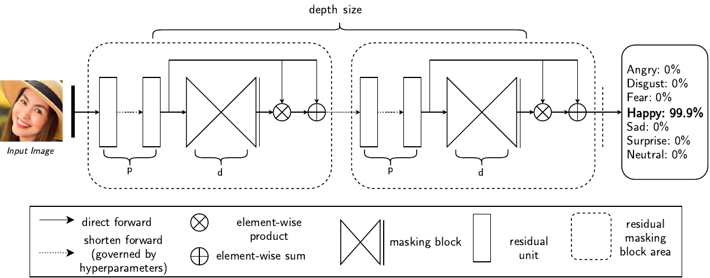
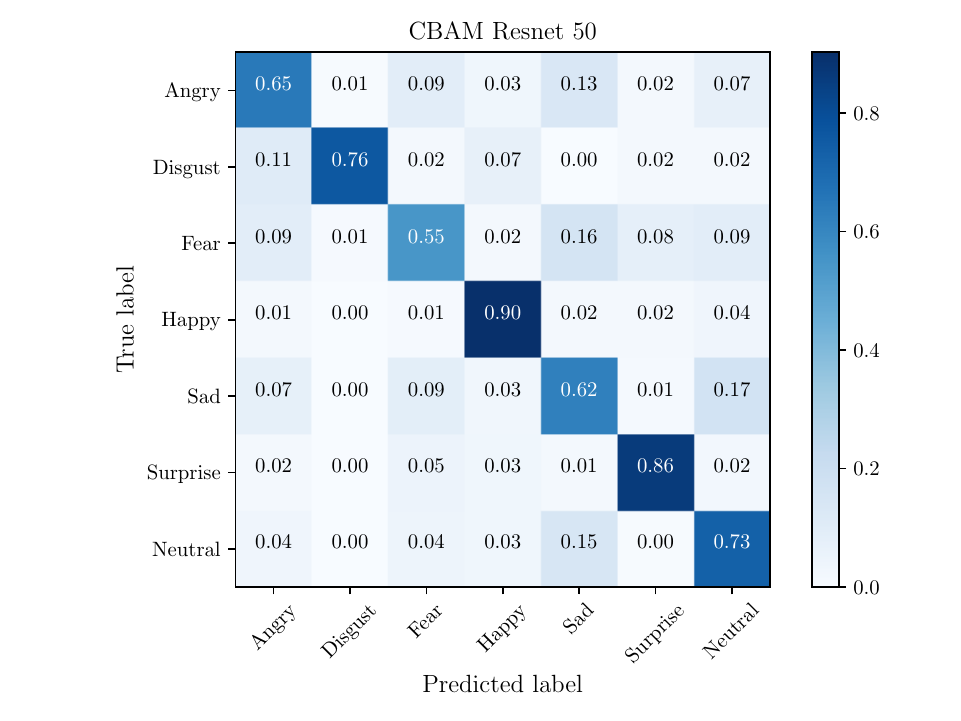

[](https://paperswithcode.com/sota/facial-expression-recognition-on-fer2013?p=challenges-in-representation-learning-a)

# Facial Expression Recognition using Residual Masking Network, in PyTorch
A [PyTorch](http://pytorch.org/) implementation of my thesis with the same name.


<p align="center">

</p>

# Live Demo:
- Model file: [download](https://drive.google.com/open?id=1_6CzlKRS9ksxlo0TjqIGXMzQE4I83tE0) (this checkpoint is trained on VEMO dataset, locate it at ```./saved/checkpoints/``` directory)
- Download 2 files: [prototxt](https://drive.google.com/open?id=1ANVPx3JM4EcJVZOstV_kEO1Jcv74mBu5), and [res10_300x300_ssd](https://drive.google.com/open?id=1Iy_3I_mWGhBA63W0IK8tRrUuvr-WrGQ2) for face detection OpenCV. Locate at current directory or checking file path with ```ssd_infer.py``` file.

```Shell
python ssd_infer.py
```


### Table of Contents
- <a href='#recent-update'>Recent Update</a>
- <a href='#benchmarking'>Benchmarking</a>

&nbsp;
&nbsp;
&nbsp;
&nbsp;

## Recent Update
 - [09/01/2020] First time upload

## Benchmarking on FER2013

We benchmark our code thoroughly on two datasets: FER2013 and VEMO. Below are the results and trained weights:

1). FER2013:

Model | Accuracy |
---------|--------|
[ResAttNet56](https://drive.google.com/open?id=1sG3ERWLPdBkjYSaZb_ynypHD15KUSsUR) | 68.54
[VGG19](https://drive.google.com/open?id=1FPkwhmel0AiGK3UtYiWCHPi5CYkF7BRc) | 70.80
[EfficientNet\_b2b](https://drive.google.com/open?id=1pEyupTGQPoX1gj0NoJQUHnK5-mxB8NcS) | 70.80
[Googlenet](https://drive.google.com/open?id=1LvxAxDmnTuXgYoqBj41qTdCRCSzaWIJr) | 71.97
[Resnext50\_32x4d](https://drive.google.com/open?id=12AR1LUlcQlg62WU_nNxBnlpqXuEV4c-c) | 72.22
[Resnet34](https://drive.google.com/open?id=1iuTkqApioWe_IBPQ7gQHticrVlPA-xz_) | 72.42
[Inception\_v3](https://drive.google.com/open?id=17mapZKWYMdxGTrbrAbRpfgniT5onmQXO) | 72.72
[Resnet50](https://drive.google.com/open?id=1PoJPhoQP12VZ-1n8JWgUqy-w2zHSHcSp) | 72.86
[Bam\_Resnet50](https://drive.google.com/open?id=1K_gyarekwIxQMA_fEPJMApgqo3mYaM0H) | 73.14
[Densenet121](https://drive.google.com/open?id=1f8wUtQj-UatrZtCnkJFcB--X2eJS1m_N) | 73.16
[Resnet152](https://drive.google.com/open?id=1LBaHaVtu8uKiNsoTN7wl5Pg5ywh-QxRW) | 73.22
[Cbam\_Resnet50](https://drive.google.com/open?id=1i9zk8sGXiixkQGTA1txBxSuew6z_c86T) | 73.39
[Resnet101](https://drive.google.com/open?id=1GadrX04NJIqtGHA85vz-ts93JuKj54ih) | 73.47
[ResMaskingNet](https://drive.google.com/open?id=1_ASpv0QNxknMFI75gwuVWi8FeeuMoGYy) | 74.14
[ResMaskingNet + 6](https://drive.google.com/open?id=1y28VHzJcgBpW0Qn_K0XVVd-hxG4feIHG) | 76.82

 
2) we are working for approval of public VEMO dataset
3) Imagenet is cominggggggggggggggggggggggggggggg


## Installation
- Install [PyTorch](http://pytorch.org/) by selecting your environment on the website and running the appropriate command.
- Clone this repository and install package [prerequisites](#prerequisites) below.
- Then download the dataset by following the [instructions](#datasets) below.
- Note: For training, we currently support [FER2013](https://drive.google.com/open?id=18ovcnZBsPvwXXFVAqczACe9zciO_1q6J) and aim to add [ImageNet](http://www.image-net.org/) support soon.


### prerequisites

* Python 3.6+
* PyTorch 1.3+
* Torchvision 0.4.0+ 
* [requirements.txt](requirements.txt)


## Datasets

### FER2013 Dataset

- [Link download](https://drive.google.com/open?id=18ovcnZBsPvwXXFVAqczACe9zciO_1q6J)


## Training  

- To train network, you need to specify model name and other hyperparameters in config file (located at configs/\*) then ensure it is loaded in main file, then run training procedure by simply run main file, for example:

```Shell
python main_fer.py  # Example for fer2013_config.json file
```

## Evaluation

For student, who takes care of font family of confusion matrix and would like to write things in LaTeX, below is an example for generating a striking confusion matrix. 

(Read [this article](https://matplotlib.org/3.1.1/tutorials/text/usetex.html) for more information, there will be some bugs if you blindly run the code without reading).

```Shell
python cm_cbam.py 
```

<p align="center">

</p>


## Ensemble method

I used no-weighted sum avarage ensemble method to fusing 7 different models together, to reproduce results, you need to do some steps:

1. Download all needed trained weights and located on ```./saved/checkpoints/``` directory.  Link to download can be found on Benchmarking section.
2. Edit file ```gen_results``` and run it to generate result offline for **each** model.
3. Run ```gen_ensemble.py``` file to generate accuracy for example methods.


## Dissertation and Slide
- [Dissertation download (in Vietnamese)](https://drive.google.com/open?id=1HxqvQSZRf-3ashGtZ5o9OABdhmdjS64a)
- [Presentation slide (in English) with full appendix](https://drive.google.com/open?id=19zweCDX8Vz4jgwJ6cBWr5x_iQPvahsQg)


## TODO
We have accumulated the following to-do list, which we hope to complete in the near future
- Still to come:
  * [x] Upload all models and training code 
  * [x] Test time augmentation
  * [x] GPU-Parallel
  * [x] Pretrained model
  * [x] Demo and inference code.
  * [ ] Imagenet
  

## Authors

* [**Luan Pham**](https://github.com/phamquiluan)
* [**Tuan Anh Tran**](https://github.com/phamquiluan)

***Note:*** Unfortunately, I am currently join a full-time job and research on another topic, so I'll do my best to keep things up to date, but no guarantees.  That being said, thanks to everyone for your continued help and feedback as it is really appreciated. I will try to address everything as soon as possible.

## References
- Same as in dissertation.


## Citation
```
@misc{luanresmaskingnet2020,
	Author = "Luan Pham, Tuan Anh Tran",
	Title = "{Facial Expression Recognition using Residual Masking Network}",
	url = "\url{https://github.com/phamquiluan/ResidualMaskingNetwork}",
	Year = "2020"
}
```

